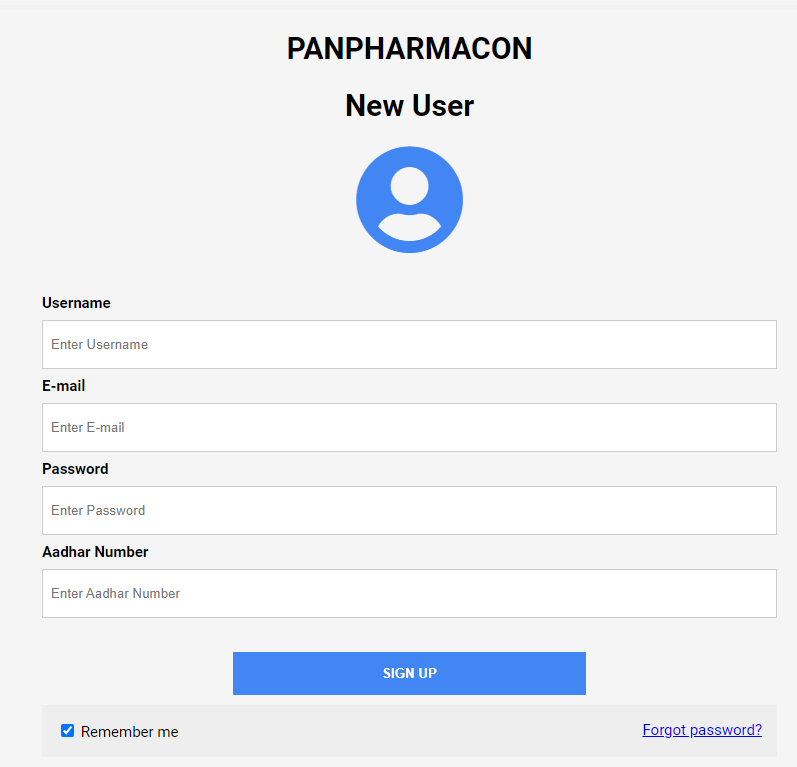
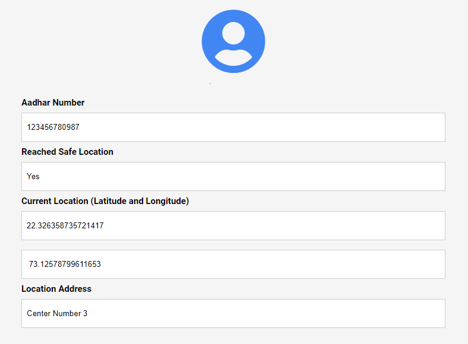
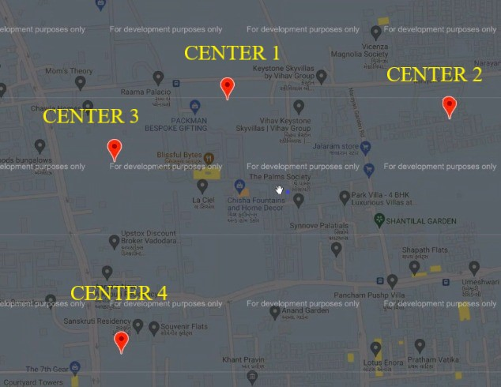
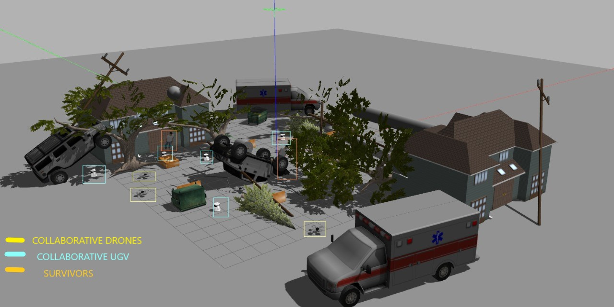
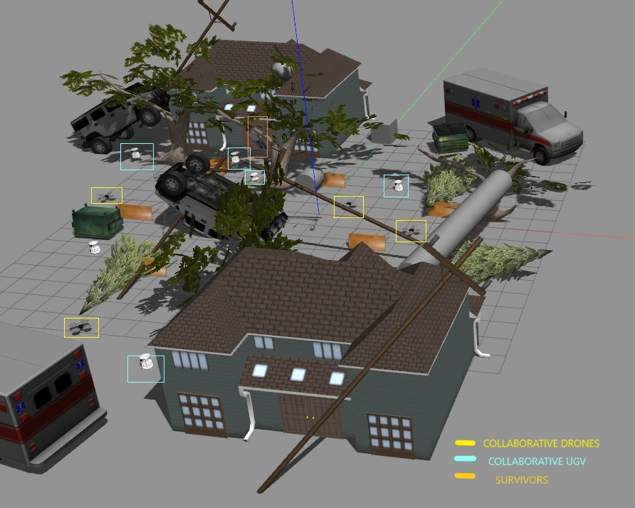

# Panpharmacon - Robot assistance for disaster management 

### Communication with people is a predicament during natural calamity. Our web based application, `Panpharmacon`, and robot assistance for survivors during earthquake disaster.

1. Before the calamity During and after the calamity With safety being the foremost priority, everyone is naturally bound to own the app and be registered in it with their basic contact and health information. In the first phase, soon after the scientists and environmentalists discover about the aforecoming calamity, Panpharmacon, with the help of government support, will display and send notification publically about the occurrence and whereabouts of the disaster, prone and safe regions, as well as the relief camp facilities that will be established in the meantime. 

## Webapp

2. During the second phase the Panacea, depending upon the registered people and their information stored in app’s database. Their GPS location will be tracked and by real time location, the app will provide the location of nearest supplies, health, relief stations and umber of people or survivors near the user. 

People successfully reaching the camp site are expected to scan the QR code present at individual camp site as an acknowledgement to the app on their safety. People who are unable to make through, have un- scanned QR code and thus the Panacea will be able to retrieve their data from database and try to approach them by provided prior information or GPS and real time location, if available, with rescue team along with the supplies as required by the victim. For more User-friendly experience, voice assistance will be provided to ensure that a havoc isn’t created among the masses during the intractable situation.

## Robot assistance

In case a victim cannot be tracked due to unavailability of internet connection, there’s an option in which the concerned people can call the nearest Help centres. At every centre, call will be recorded and automated analysis of the call will be done to find the Severity of the call using machine learning in real time. Analysis of the call will be done considering various factors like the demand of the person(food , medicine etc.), the location and the number of times a call is being received from the same location. After calculating the Severity , we can send supplies to the place where the Severity calculated is the highest through drones and robots.
